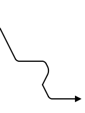
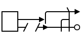
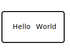
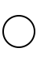
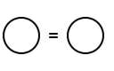

# sample.decls [&equiv;](../index.md)

Module description.



## Index

- <a href="../sample/decls.md" id="index-link"
  class="link">sample.decls</a>
  - <a href="../sample/decls.md#sample-decls-C" id="index-link"
    class="link"><code>C</code></a>
  - <a href="../sample/decls.md#sample-decls-CrazyNumbers" id="index-link"
    class="link"><code>CrazyNumbers</code></a>
  - <a href="../sample/decls.md#sample-decls-D" id="index-link"
    class="link"><code>D</code></a>
  - <a href="../sample/decls.md#sample-decls-Foo" id="index-link"
    class="link"><code>Foo</code></a>
  - <a href="../sample/decls.md#sample-decls-W" id="index-link"
    class="link"><code>W</code></a>
  - <a href="../sample/decls.md#sample-decls-accessor_test" id="index-link"
    class="link"><code>accessor_test</code></a>
  - <a href="../sample/decls.md#sample-decls-apply" id="index-link"
    class="link"><code>apply</code></a>
  - <a href="../sample/decls.md#sample-decls-array_alias" id="index-link"
    class="link"><code>array_alias</code></a>
  - <a href="../sample/decls.md#sample-decls-bool_alias" id="index-link"
    class="link"><code>bool_alias</code></a>
  - <a href="../sample/decls.md#sample-decls-cast_test" id="index-link"
    class="link"><code>cast_test</code></a>
  - <a href="../sample/decls.md#sample-decls-constant" id="index-link"
    class="link"><code>constant</code></a>
  - <a href="../sample/decls.md#sample-decls-foo" id="index-link"
    class="link"><code>foo</code></a>
  - <a href="../sample/decls.md#sample-decls-index_t" id="index-link"
    class="link"><code>index_t</code></a>
  - <a href="../sample/decls.md#sample-decls-long_template_template_test"
    id="index-link"
    class="link"><code>long_template_template_test</code></a>
  - <a href="../sample/decls.md#sample-decls-long_template_test"
    id="index-link" class="link"><code>long_template_test</code></a>
  - <a href="../sample/decls.md#sample-decls-many_arg_fun" id="index-link"
    class="link"><code>many_arg_fun</code></a>
  - <a href="../sample/decls.md#sample-decls-markup_sample" id="index-link"
    class="link"><code>markup_sample</code></a>
  - <a href="../sample/decls.md#sample-decls-mem" id="index-link"
    class="link"><code>mem</code></a>
  - <a href="../sample/decls.md#sample-decls-private_public_test"
    id="index-link" class="link"><code>private_public_test</code></a>
  - <a href="../sample/decls.md#sample-decls-sample_class" id="index-link"
    class="link"><code>sample_class</code></a>
  - <a href="../sample/decls.md#sample-decls-sample_struct" id="index-link"
    class="link"><code>sample_struct</code></a>
  - <a href="../sample/decls.md#sample-decls-sample_union" id="index-link"
    class="link"><code>sample_union</code></a>
  - <a href="../sample/decls.md#sample-decls-svgbob_test" id="index-link"
    class="link"><code>svgbob_test</code></a>
  - <a href="../sample/decls.md#sample-decls-svgbob_test2" id="index-link"
    class="link"><code>svgbob_test2</code></a>
  - <a href="../sample/decls.md#sample-decls-svgbob_test3" id="index-link"
    class="link"><code>svgbob_test3</code></a>
  - <a href="../sample/decls.md#sample-decls-template_template_test"
    id="index-link" class="link"><code>template_template_test</code></a>

------------------------------------------------------------------------

<pre style="font-family:monospace;background-color:#f2f3f4;color:#373d3f;border:1px solid #dddddd;border-left:3px solid #0080ff;border-radius:5px 5px 5px 5px;margin-bottom:0.5em;padding:0.5em 1em 0.5em 1em">
<span style="color:#60ac39">using</span> <span style="font-weight:bold">bool_alias</span> = <span style="color:#cfb017">bool</span> <a style="color:#c5c8c6" href="#sample-decls-bool_alias" id="sample-decls-bool_alias">§</a>
</pre>

pre-alias description.

post-alias description.

<pre style="font-family:monospace;background-color:#f2f3f4;color:#373d3f;border:1px solid #dddddd;border-left:3px solid #0080ff;border-radius:5px 5px 5px 5px;margin-bottom:0.5em;padding:0.5em 1em 0.5em 1em">
<span style="color:#60ac39">template</span> &lt;<span style="color:#60ac39">typename</span> T = <span style="color:#60ac39">uint8</span>, <span style="color:#60ac39">auto</span> N = <span style="color:#d73737">26</span>&gt;
<span style="color:#60ac39">using</span> <span style="font-weight:bold">array_alias</span> = T[N] <a style="color:#c5c8c6" href="#sample-decls-array_alias" id="sample-decls-array_alias">§</a>
</pre>
<details>

<summary>Parameters</summary>

- <pre style="font-family:monospace;background-color:#f2f3f4;color:#373d3f;border:1px solid #dddddd;border-left:3px solid #0080ff;border-radius:5px 5px 5px 5px;margin-bottom:0.5em;padding:0.5em 1em 0.5em 1em">
  <span style="color:#60ac39">typename</span> T = <span style="color:#60ac39">uint8</span>
  </pre>

  Pre-param 1.

  Post-param 1.

- <pre style="font-family:monospace;background-color:#f2f3f4;color:#373d3f;border:1px solid #dddddd;border-left:3px solid #0080ff;border-radius:5px 5px 5px 5px;margin-bottom:0.5em;padding:0.5em 1em 0.5em 1em">
  <span style="color:#60ac39">auto</span> N = <span style="color:#d73737">26</span>
  </pre>

  Pre-param 2.

  Post-param 2.

</details>
<pre style="font-family:monospace;background-color:#f2f3f4;color:#373d3f;border:1px solid #dddddd;border-left:3px solid #0080ff;border-radius:5px 5px 5px 5px;margin-bottom:0.5em;padding:0.5em 1em 0.5em 1em">
<span style="color:#60ac39">template</span> &lt;<span style="color:#60ac39">auto</span> N&gt;
<span style="color:#60ac39">using</span> <span style="font-weight:bold">index_t</span> = <span style="color:#cfb017">uint</span>&lt;(N &gt; <span style="color:#d73737">1</span>) ? <span style="color:#cfb017">clog2</span>(N) : <span style="color:#d73737">1</span>&gt; <a style="color:#c5c8c6" href="#sample-decls-index_t" id="sample-decls-index_t">§</a>
</pre>
<pre style="font-family:monospace;background-color:#f2f3f4;color:#373d3f;border:1px solid #dddddd;border-left:3px solid #0080ff;border-radius:5px 5px 5px 5px;margin-bottom:0.5em;padding:0.5em 1em 0.5em 1em">
<span style="color:#60ac39">union</span> <span style="font-weight:bold">sample_union</span> <a style="color:#c5c8c6" href="#sample-decls-sample_union" id="sample-decls-sample_union">§</a>
</pre>

pre-union description.

post-union description.

<details>

<summary>Fields</summary>

- <pre style="font-family:monospace;background-color:#f2f3f4;color:#373d3f;border:1px solid #dddddd;border-left:3px solid #0080ff;border-radius:5px 5px 5px 5px;margin-bottom:0.5em;padding:0.5em 1em 0.5em 1em">
  <span style="color:#60ac39">uint8</span> <span style="font-weight:bold">larger</span> <a style="color:#c5c8c6" href="#sample-decls-$quasi0-larger" id="sample-decls-$quasi0-larger">§</a>
  </pre>

  pre-field 1.

  post-field 1.

- <pre style="font-family:monospace;background-color:#f2f3f4;color:#373d3f;border:1px solid #dddddd;border-left:3px solid #0080ff;border-radius:5px 5px 5px 5px;margin-bottom:0.5em;padding:0.5em 1em 0.5em 1em">
  <span style="color:#60ac39">uint4</span> <span style="font-weight:bold">smaller</span> <a style="color:#c5c8c6" href="#sample-decls-$quasi0-smaller" id="sample-decls-$quasi0-smaller">§</a>
  </pre>

  pre-field 2.

  post-field 2.

</details>
<pre style="font-family:monospace;background-color:#f2f3f4;color:#373d3f;border:1px solid #dddddd;border-left:3px solid #0080ff;border-radius:5px 5px 5px 5px;margin-bottom:0.5em;padding:0.5em 1em 0.5em 1em">
<span style="color:#60ac39">struct</span> <span style="font-weight:bold">sample_struct</span> <a style="color:#c5c8c6" href="#sample-decls-sample_struct" id="sample-decls-sample_struct">§</a>
</pre>

Pre-struct description.

Post-struct description.

<details>

<summary>Fields</summary>

- <pre style="font-family:monospace;background-color:#f2f3f4;color:#373d3f;border:1px solid #dddddd;border-left:3px solid #0080ff;border-radius:5px 5px 5px 5px;margin-bottom:0.5em;padding:0.5em 1em 0.5em 1em">
  <span style="color:#cfb017">float32</span> <span style="font-weight:bold">struct_field1</span> <a style="color:#c5c8c6" href="#sample-decls-$quasi1-struct_field1" id="sample-decls-$quasi1-struct_field1">§</a>
  </pre>

  Pre-field 1.

  Post-field 1.

- <pre style="font-family:monospace;background-color:#f2f3f4;color:#373d3f;border:1px solid #dddddd;border-left:3px solid #0080ff;border-radius:5px 5px 5px 5px;margin-bottom:0.5em;padding:0.5em 1em 0.5em 1em">
  <span style="color:#cfb017">bool</span>[<span style="color:#d73737">4</span>][<span style="color:#d73737">5</span>][<span style="color:#d73737">6</span>] <span style="font-weight:bold">struct_field2</span> <a style="color:#c5c8c6" href="#sample-decls-$quasi1-struct_field2" id="sample-decls-$quasi1-struct_field2">§</a>
  </pre>

  Pre-field 2.

  Post-field 2.

</details>
<pre style="font-family:monospace;background-color:#f2f3f4;color:#373d3f;border:1px solid #dddddd;border-left:3px solid #0080ff;border-radius:5px 5px 5px 5px;margin-bottom:0.5em;padding:0.5em 1em 0.5em 1em">
<span style="color:#60ac39">enum</span> <span style="font-weight:bold">CrazyNumbers</span> : <span style="color:#60ac39">uint5</span> <a style="color:#c5c8c6" href="#sample-decls-CrazyNumbers" id="sample-decls-CrazyNumbers">§</a>
</pre>

Pre-enum description.

Post-enum description.

<details>

<summary>Values</summary>

- <pre style="font-family:monospace;background-color:#f2f3f4;color:#373d3f;border:1px solid #dddddd;border-left:3px solid #0080ff;border-radius:5px 5px 5px 5px;margin-bottom:0.5em;padding:0.5em 1em 0.5em 1em">
  <span style="font-weight:bold">ONE</span> = <span style="color:#d73737">1</span> <a style="color:#c5c8c6" href="#sample-decls-CrazyNumbers-ONE" id="sample-decls-CrazyNumbers-ONE">§</a>
  </pre>

  Pre-value ONE.

  Post-value ONE.

- <pre style="font-family:monospace;background-color:#f2f3f4;color:#373d3f;border:1px solid #dddddd;border-left:3px solid #0080ff;border-radius:5px 5px 5px 5px;margin-bottom:0.5em;padding:0.5em 1em 0.5em 1em">
  <span style="font-weight:bold">FIVE</span> = (<a style="color:#6684e1" href="../sample/decls.md#sample-decls-CrazyNumbers"><span style="font-weight:bold">CrazyNumbers</span></a>::<a style="color:#6684e1" href="../sample/decls.md#sample-decls-CrazyNumbers-ONE"><span style="font-weight:bold">ONE</span></a> + <span style="color:#d73737">2</span>) <a style="color:#c5c8c6" href="#sample-decls-CrazyNumbers-FIVE" id="sample-decls-CrazyNumbers-FIVE">§</a>
  </pre>

  Pre-value FIVE.

  Post-value FIVE.

- <pre style="font-family:monospace;background-color:#f2f3f4;color:#373d3f;border:1px solid #dddddd;border-left:3px solid #0080ff;border-radius:5px 5px 5px 5px;margin-bottom:0.5em;padding:0.5em 1em 0.5em 1em">
  <span style="font-weight:bold">NINE</span> = <span style="color:#d73737">0</span> <a style="color:#c5c8c6" href="#sample-decls-CrazyNumbers-NINE" id="sample-decls-CrazyNumbers-NINE">§</a>
  </pre>

  Pre-value NINE.

  Post-value NINE.

- <pre style="font-family:monospace;background-color:#f2f3f4;color:#373d3f;border:1px solid #dddddd;border-left:3px solid #0080ff;border-radius:5px 5px 5px 5px;margin-bottom:0.5em;padding:0.5em 1em 0.5em 1em">
  <span style="font-weight:bold">FIFTEEN</span> <a style="color:#c5c8c6" href="#sample-decls-CrazyNumbers-FIFTEEN" id="sample-decls-CrazyNumbers-FIFTEEN">§</a>
  </pre>

  Pre-value FIFTEEN.

  Post-value FIFTEEN.

</details>
<pre style="font-family:monospace;background-color:#f2f3f4;color:#373d3f;border:1px solid #dddddd;border-left:3px solid #0080ff;border-radius:5px 5px 5px 5px;margin-bottom:0.5em;padding:0.5em 1em 0.5em 1em">
<span style="color:#60ac39">template</span> &lt;<span style="color:#60ac39">typename</span> T, (T, T) -&gt; <span style="color:#cfb017">bool</span> p&gt;
<span style="color:#b854d4">inline </span><span style="color:#60ac39">void</span> <span style="font-weight:bold">foo</span>((<span style="color:#60ac39">uint32</span>, <span style="color:#60ac39">uint32</span> <span style="font-weight:bold">b</span>) -&gt; <span style="color:#cfb017">bool</span> <span style="font-weight:bold">fn</span>, <span style="color:#60ac39">uint32</span> <span style="font-weight:bold">x</span>) <a style="color:#c5c8c6" href="#sample-decls-foo" id="sample-decls-foo">§</a>
</pre>

Pre-function description.

Post-function description.

<details>

<summary>Parameters</summary>

- <pre style="font-family:monospace;background-color:#f2f3f4;color:#373d3f;border:1px solid #dddddd;border-left:3px solid #0080ff;border-radius:5px 5px 5px 5px;margin-bottom:0.5em;padding:0.5em 1em 0.5em 1em">
  <span style="color:#60ac39">typename</span> T
  </pre>

  Pre param T.

  Post param T.

- <pre style="font-family:monospace;background-color:#f2f3f4;color:#373d3f;border:1px solid #dddddd;border-left:3px solid #0080ff;border-radius:5px 5px 5px 5px;margin-bottom:0.5em;padding:0.5em 1em 0.5em 1em">
  (T, T) -&gt; <span style="color:#cfb017">bool</span> p
  </pre>

  Pre param p.

  Post param p.

</details>
<details>

<summary>Arguments</summary>

- <pre style="font-family:monospace;background-color:#f2f3f4;color:#373d3f;border:1px solid #dddddd;border-left:3px solid #0080ff;border-radius:5px 5px 5px 5px;margin-bottom:0.5em;padding:0.5em 1em 0.5em 1em">
  (<span style="color:#60ac39">uint32</span>, <span style="color:#60ac39">uint32</span> <span style="font-weight:bold">b</span>) -&gt; <span style="color:#cfb017">bool</span> <span style="font-weight:bold">fn</span>
  </pre>

  post function param fn

  <details>

  <summary>Arguments</summary>

  - <pre style="font-family:monospace;background-color:#f2f3f4;color:#373d3f;border:1px solid #dddddd;border-left:3px solid #0080ff;border-radius:5px 5px 5px 5px;margin-bottom:0.5em;padding:0.5em 1em 0.5em 1em">
    <span style="color:#60ac39">uint32</span>
    </pre>

    post first param of function function param

  - <pre style="font-family:monospace;background-color:#f2f3f4;color:#373d3f;border:1px solid #dddddd;border-left:3px solid #0080ff;border-radius:5px 5px 5px 5px;margin-bottom:0.5em;padding:0.5em 1em 0.5em 1em">
    <span style="color:#60ac39">uint32</span> <span style="font-weight:bold">b</span>
    </pre>

    post second param of function function param

  </details>

- <pre style="font-family:monospace;background-color:#f2f3f4;color:#373d3f;border:1px solid #dddddd;border-left:3px solid #0080ff;border-radius:5px 5px 5px 5px;margin-bottom:0.5em;padding:0.5em 1em 0.5em 1em">
  <span style="color:#60ac39">uint32</span> <span style="font-weight:bold">x</span>
  </pre>

  pre param x

  post param x

</details>
<pre style="font-family:monospace;background-color:#f2f3f4;color:#373d3f;border:1px solid #dddddd;border-left:3px solid #0080ff;border-radius:5px 5px 5px 5px;margin-bottom:0.5em;padding:0.5em 1em 0.5em 1em">
<span style="color:#b854d4">inline </span><span style="color:#60ac39">void</span> <span style="font-weight:bold">markup_sample</span>() <a style="color:#c5c8c6" href="#sample-decls-markup_sample" id="sample-decls-markup_sample">§</a>
</pre>

This is *emphasis*, **bold**, and `monospace`

## H2 sub-heading

Bullet list:

- A

  - nest A

- B

Enumerated list:

1.  One

<!-- -->

1.  Two

Definition list:

Term 1  
Definition 1

Term 2 with *inline markup*  
Definition 2

``` kanagawa
{ some code, part of Definition 2 }
```

Third paragraph of definition 2.

| Header rows optional | Header 2 |
|----------------------|----------|
| body row 1, col 1    | col 2    |
| body row 2, col 1    | col 2    |

| Right | Left | Default | Center |
|------:|:-----|---------|:------:|
|    12 | 12   | 12      |   12   |
|   123 | 123  | 123     |  123   |
|     1 | 1    | 1       |   1    |

Math support:

$$
f(a) = \frac{1}{2\pi i}\oint_\gamma \frac{f(z)}{z-a}\,\mathrm{d}z
$$

Inline mathematics: Area of a circle is $\pi r^2$ and
$Nat(h^A,F)\cong FA$ is the yoneda lemma.

Urls and links:

<https://bing.com> [bing](https://bing.com) https://bing.com

Code block:

``` cpp
some_code_block<example>([](t d)
{
    return "yes";
});
```

Another code block:

``` kanagawa
some_code_block<example>([](t d)
{
    return "yes";
});
```

Test inline code: Some `simple` inline Try `array_alias<bool_alias>`
brackets. Test single quotes: ‘single\_quote’, with brackets ‘all<id>’
Some `array_alias<index_t <8 >>` more inline.

Won’t this cause an issue? Isn’t this fun!

Escapable characters: \\ / ' \` " @ &lt; \$ \# &gt; \* -

\`not code either\`, but `this is code`.

&lt;thisisnotalink.com&gt;

More `test formatting`. `isn't\' won't<\'\`&gt;@

[To custom-anchor](links.md#custom-anchor)

<pre style="font-family:monospace;background-color:#f2f3f4;color:#373d3f;border:1px solid #dddddd;border-left:3px solid #0080ff;border-radius:5px 5px 5px 5px;margin-bottom:0.5em;padding:0.5em 1em 0.5em 1em">
<span style="color:#60ac39">template</span> &lt;<span style="color:#60ac39">auto</span> N, <span style="color:#60ac39">uint32</span> M, <span style="color:#60ac39">typename</span> T&gt;
<span style="color:#60ac39">class</span> <span style="font-weight:bold">sample_class</span> <a style="color:#c5c8c6" href="#sample-decls-sample_class" id="sample-decls-sample_class">§</a>
</pre>

pre class description.

post class description.

<details>

<summary>Parameters</summary>

- <pre style="font-family:monospace;background-color:#f2f3f4;color:#373d3f;border:1px solid #dddddd;border-left:3px solid #0080ff;border-radius:5px 5px 5px 5px;margin-bottom:0.5em;padding:0.5em 1em 0.5em 1em">
  <span style="color:#60ac39">auto</span> N
  </pre>

  pre param N.

  post param N.

- <pre style="font-family:monospace;background-color:#f2f3f4;color:#373d3f;border:1px solid #dddddd;border-left:3px solid #0080ff;border-radius:5px 5px 5px 5px;margin-bottom:0.5em;padding:0.5em 1em 0.5em 1em">
  <span style="color:#60ac39">uint32</span> M
  </pre>

  pre param M.

  post param M.

- <pre style="font-family:monospace;background-color:#f2f3f4;color:#373d3f;border:1px solid #dddddd;border-left:3px solid #0080ff;border-radius:5px 5px 5px 5px;margin-bottom:0.5em;padding:0.5em 1em 0.5em 1em">
  <span style="color:#60ac39">typename</span> T
  </pre>

  pre param T.

  post param T

</details>
<details>

<summary>Aliases</summary>

- <pre style="font-family:monospace;background-color:#f2f3f4;color:#373d3f;border:1px solid #dddddd;border-left:3px solid #0080ff;border-radius:5px 5px 5px 5px;margin-bottom:0.5em;padding:0.5em 1em 0.5em 1em">
  <span style="color:#60ac39">using</span> <span style="font-weight:bold">index_square_t</span> = <a style="color:#6684e1" href="../sample/decls.md#sample-decls-index_t"><span style="font-weight:bold">index_t</span></a>&lt;<a style="color:#6684e1" href="../sample/decls.md#sample-decls-sample_class"><span style="font-weight:bold">sample_class</span></a>::<a style="color:#6684e1" href="../sample/decls.md#sample-decls-sample_class-Square"><span style="font-weight:bold">Square</span></a>&gt; <a style="color:#c5c8c6" href="#sample-decls-sample_class-index_square_t" id="sample-decls-sample_class-index_square_t">§</a>
  </pre>

  pre index\_square\_t.

</details>
<details>

<summary>Types</summary>

- <pre style="font-family:monospace;background-color:#f2f3f4;color:#373d3f;border:1px solid #dddddd;border-left:3px solid #0080ff;border-radius:5px 5px 5px 5px;margin-bottom:0.5em;padding:0.5em 1em 0.5em 1em">
  <span style="color:#60ac39">template</span> &lt;<span style="color:#60ac39">typename</span> S&gt;
  <span style="color:#60ac39">struct</span> <span style="font-weight:bold">nested_struct</span> <a style="color:#c5c8c6" href="#sample-decls-sample_class-nested_struct" id="sample-decls-sample_class-nested_struct">§</a>
  </pre>

  nested struct

  <details>

  <summary>Parameters</summary>

  - <pre style="font-family:monospace;background-color:#f2f3f4;color:#373d3f;border:1px solid #dddddd;border-left:3px solid #0080ff;border-radius:5px 5px 5px 5px;margin-bottom:0.5em;padding:0.5em 1em 0.5em 1em">
    <span style="color:#60ac39">typename</span> S
    </pre>

    S doc.

  </details>
  <details>

  <summary>Fields</summary>

  - <pre style="font-family:monospace;background-color:#f2f3f4;color:#373d3f;border:1px solid #dddddd;border-left:3px solid #0080ff;border-radius:5px 5px 5px 5px;margin-bottom:0.5em;padding:0.5em 1em 0.5em 1em">
    <span style="color:#60ac39">uint32</span> <span style="font-weight:bold">nested_field_1</span> <a style="color:#c5c8c6" href="#sample-decls-sample_class-$quasi0-nested_field_1" id="sample-decls-sample_class-$quasi0-nested_field_1">§</a>
    </pre>

    nested field 1.

  - <pre style="font-family:monospace;background-color:#f2f3f4;color:#373d3f;border:1px solid #dddddd;border-left:3px solid #0080ff;border-radius:5px 5px 5px 5px;margin-bottom:0.5em;padding:0.5em 1em 0.5em 1em">
    S <span style="font-weight:bold">nested_field_2</span> <a style="color:#c5c8c6" href="#sample-decls-sample_class-$quasi0-nested_field_2" id="sample-decls-sample_class-$quasi0-nested_field_2">§</a>
    </pre>

    nested field 2.

  </details>

- <pre style="font-family:monospace;background-color:#f2f3f4;color:#373d3f;border:1px solid #dddddd;border-left:3px solid #0080ff;border-radius:5px 5px 5px 5px;margin-bottom:0.5em;padding:0.5em 1em 0.5em 1em">
  <span style="color:#60ac39">class</span> <span style="font-weight:bold">nested_class</span> <a style="color:#c5c8c6" href="#sample-decls-sample_class-nested_class" id="sample-decls-sample_class-nested_class">§</a>
  </pre>

  nested\_class

  <details>

  <summary>Types</summary>

  - <pre style="font-family:monospace;background-color:#f2f3f4;color:#373d3f;border:1px solid #dddddd;border-left:3px solid #0080ff;border-radius:5px 5px 5px 5px;margin-bottom:0.5em;padding:0.5em 1em 0.5em 1em">
    <span style="color:#60ac39">enum</span> <span style="font-weight:bold">nested_nested_enum</span> : <span style="color:#60ac39">uint1</span> <a style="color:#c5c8c6" href="#sample-decls-sample_class-nested_class-nested_nested_enum" id="sample-decls-sample_class-nested_class-nested_nested_enum">§</a>
    </pre>

    nested\_nested\_enum

    <details>

    <summary>Values</summary>

    - <pre style="font-family:monospace;background-color:#f2f3f4;color:#373d3f;border:1px solid #dddddd;border-left:3px solid #0080ff;border-radius:5px 5px 5px 5px;margin-bottom:0.5em;padding:0.5em 1em 0.5em 1em">
      <span style="font-weight:bold">ON</span> <a style="color:#c5c8c6" href="#sample-decls-sample_class-nested_class-nested_nested_enum-ON" id="sample-decls-sample_class-nested_class-nested_nested_enum-ON">§</a>
      </pre>

      On.

    - <pre style="font-family:monospace;background-color:#f2f3f4;color:#373d3f;border:1px solid #dddddd;border-left:3px solid #0080ff;border-radius:5px 5px 5px 5px;margin-bottom:0.5em;padding:0.5em 1em 0.5em 1em">
      <span style="font-weight:bold">OFF</span> <a style="color:#c5c8c6" href="#sample-decls-sample_class-nested_class-nested_nested_enum-OFF" id="sample-decls-sample_class-nested_class-nested_nested_enum-OFF">§</a>
      </pre>

    </details>

  </details>

- <pre style="font-family:monospace;background-color:#f2f3f4;color:#373d3f;border:1px solid #dddddd;border-left:3px solid #0080ff;border-radius:5px 5px 5px 5px;margin-bottom:0.5em;padding:0.5em 1em 0.5em 1em">
  <span style="color:#60ac39">template</span> &lt;<span style="color:#60ac39">typename</span> S&gt;
  <span style="color:#60ac39">class</span> <span style="font-weight:bold">Foo</span> <a style="color:#c5c8c6" href="#sample-decls-sample_class-Foo" id="sample-decls-sample_class-Foo">§</a>
  </pre>
  <details>

  <summary>Aliases</summary>

  - <pre style="font-family:monospace;background-color:#f2f3f4;color:#373d3f;border:1px solid #dddddd;border-left:3px solid #0080ff;border-radius:5px 5px 5px 5px;margin-bottom:0.5em;padding:0.5em 1em 0.5em 1em">
    <span style="color:#60ac39">template</span> &lt;<span style="color:#60ac39">auto</span> N&gt;
    <span style="color:#60ac39">using</span> <span style="font-weight:bold">t</span> = S[N] <a style="color:#c5c8c6" href="#sample-decls-sample_class-Foo-t" id="sample-decls-sample_class-Foo-t">§</a>
    </pre>

  </details>

</details>
<details>

<summary>Callbacks and Fields</summary>

- <pre style="font-family:monospace;background-color:#f2f3f4;color:#373d3f;border:1px solid #dddddd;border-left:3px solid #0080ff;border-radius:5px 5px 5px 5px;margin-bottom:0.5em;padding:0.5em 1em 0.5em 1em">
  <span style="color:#60ac39">uint8</span> <span style="font-weight:bold">private_uint8</span> = <span style="color:#d73737">255</span> <a style="color:#c5c8c6" href="#sample-decls-sample_class-private_uint8" id="sample-decls-sample_class-private_uint8">§</a>
  </pre>

  pre private uint8.

- <pre style="font-family:monospace;background-color:#f2f3f4;color:#373d3f;border:1px solid #dddddd;border-left:3px solid #0080ff;border-radius:5px 5px 5px 5px;margin-bottom:0.5em;padding:0.5em 1em 0.5em 1em">
  <span style="color:#60ac39">const</span> <span style="color:#60ac39">auto</span> <span style="font-weight:bold">Square</span> = (N * N) <a style="color:#c5c8c6" href="#sample-decls-sample_class-Square" id="sample-decls-sample_class-Square">§</a>
  </pre>

  pre square N.

- <pre style="font-family:monospace;background-color:#f2f3f4;color:#373d3f;border:1px solid #dddddd;border-left:3px solid #0080ff;border-radius:5px 5px 5px 5px;margin-bottom:0.5em;padding:0.5em 1em 0.5em 1em">
  <span style="color:#60ac39">uint8</span> <span style="font-weight:bold">public_uint8</span> = <span style="color:#d73737">254</span> <a style="color:#c5c8c6" href="#sample-decls-sample_class-public_uint8" id="sample-decls-sample_class-public_uint8">§</a>
  </pre>

  pre public uint8.

- <pre style="font-family:monospace;background-color:#f2f3f4;color:#373d3f;border:1px solid #dddddd;border-left:3px solid #0080ff;border-radius:5px 5px 5px 5px;margin-bottom:0.5em;padding:0.5em 1em 0.5em 1em">
  <span style="color:#60ac39">const</span> <span style="color:#cfb017">string</span> <span style="font-weight:bold">public_string</span> = <span style="color:#d73737">&quot;Hello World&quot;</span> <a style="color:#c5c8c6" href="#sample-decls-sample_class-public_string" id="sample-decls-sample_class-public_string">§</a>
  </pre>

  pre public string.

  post public string

- <pre style="font-family:monospace;background-color:#f2f3f4;color:#373d3f;border:1px solid #dddddd;border-left:3px solid #0080ff;border-radius:5px 5px 5px 5px;margin-bottom:0.5em;padding:0.5em 1em 0.5em 1em">
  <a style="color:#6684e1" href="../sample/decls.md#sample-decls-bool_alias"><span style="font-weight:bold">bool_alias</span></a> <span style="font-weight:bold">bool_literal</span> = <span style="color:#d73737">true</span> <a style="color:#c5c8c6" href="#sample-decls-sample_class-bool_literal" id="sample-decls-sample_class-bool_literal">§</a>
  </pre>

- <pre style="font-family:monospace;background-color:#f2f3f4;color:#373d3f;border:1px solid #dddddd;border-left:3px solid #0080ff;border-radius:5px 5px 5px 5px;margin-bottom:0.5em;padding:0.5em 1em 0.5em 1em">
  <a style="color:#6684e1" href="../sample/decls.md#sample-decls-sample_class"><span style="font-weight:bold">sample_class</span></a>::<a style="color:#6684e1" href="../sample/decls.md#sample-decls-sample_class-Foo"><span style="font-weight:bold">Foo</span></a>&lt;<span style="color:#60ac39">uint32</span>&gt;::<a style="color:#6684e1" href="../sample/decls.md#sample-decls-sample_class-Foo-t"><span style="font-weight:bold">t</span></a>&lt;<span style="color:#d73737">10</span>&gt; <span style="font-weight:bold">x</span> <a style="color:#c5c8c6" href="#sample-decls-sample_class-x" id="sample-decls-sample_class-x">§</a>
  </pre>

  Description

</details>
<details>

<summary>Methods</summary>

- <pre style="font-family:monospace;background-color:#f2f3f4;color:#373d3f;border:1px solid #dddddd;border-left:3px solid #0080ff;border-radius:5px 5px 5px 5px;margin-bottom:0.5em;padding:0.5em 1em 0.5em 1em">
  <span style="color:#60ac39">void</span> <span style="font-weight:bold">bar</span>(<span style="color:#60ac39">uint32</span> <span style="font-weight:bold">x</span>, <span style="color:#cfb017">bool</span> <span style="font-weight:bold">b</span>) <a style="color:#c5c8c6" href="#sample-decls-sample_class-bar" id="sample-decls-sample_class-bar">§</a>
  </pre>

  pre method bar.

  <details>

  <summary>Arguments</summary>

  - <pre style="font-family:monospace;background-color:#f2f3f4;color:#373d3f;border:1px solid #dddddd;border-left:3px solid #0080ff;border-radius:5px 5px 5px 5px;margin-bottom:0.5em;padding:0.5em 1em 0.5em 1em">
    <span style="color:#60ac39">uint32</span> <span style="font-weight:bold">x</span>
    </pre>

    pre x.

    post x.

  - <pre style="font-family:monospace;background-color:#f2f3f4;color:#373d3f;border:1px solid #dddddd;border-left:3px solid #0080ff;border-radius:5px 5px 5px 5px;margin-bottom:0.5em;padding:0.5em 1em 0.5em 1em">
    <span style="color:#cfb017">bool</span> <span style="font-weight:bold">b</span>
    </pre>

    pre b.

    post b.

  </details>

</details>
<details>

<summary>Invariants</summary>

- <pre style="font-family:monospace;background-color:#f2f3f4;color:#373d3f;border:1px solid #dddddd;border-left:3px solid #0080ff;border-radius:5px 5px 5px 5px;margin-bottom:0.5em;padding:0.5em 1em 0.5em 1em">
  (<span style="color:#d73737">0</span> == (N &amp; (N - <span style="color:#d73737">1</span>)))
  </pre>

  pre assert.

  post assert

</details>
<pre style="font-family:monospace;background-color:#f2f3f4;color:#373d3f;border:1px solid #dddddd;border-left:3px solid #0080ff;border-radius:5px 5px 5px 5px;margin-bottom:0.5em;padding:0.5em 1em 0.5em 1em">
<span style="color:#60ac39">class</span> <span style="font-weight:bold">C</span> <a style="color:#c5c8c6" href="#sample-decls-C" id="sample-decls-C">§</a>
</pre>
<details>

<summary>Types</summary>

- <pre style="font-family:monospace;background-color:#f2f3f4;color:#373d3f;border:1px solid #dddddd;border-left:3px solid #0080ff;border-radius:5px 5px 5px 5px;margin-bottom:0.5em;padding:0.5em 1em 0.5em 1em">
  <span style="color:#60ac39">class</span> <span style="font-weight:bold">D</span> <a style="color:#c5c8c6" href="#sample-decls-C-D" id="sample-decls-C-D">§</a>
  </pre>
  <details>

  <summary>Aliases</summary>

  - <pre style="font-family:monospace;background-color:#f2f3f4;color:#373d3f;border:1px solid #dddddd;border-left:3px solid #0080ff;border-radius:5px 5px 5px 5px;margin-bottom:0.5em;padding:0.5em 1em 0.5em 1em">
    <span style="color:#60ac39">using</span> <span style="font-weight:bold">E</span> = <span style="color:#cfb017">bool</span> <a style="color:#c5c8c6" href="#sample-decls-C-D-E" id="sample-decls-C-D-E">§</a>
    </pre>

  </details>
  <details>

  <summary>Types</summary>

  - <pre style="font-family:monospace;background-color:#f2f3f4;color:#373d3f;border:1px solid #dddddd;border-left:3px solid #0080ff;border-radius:5px 5px 5px 5px;margin-bottom:0.5em;padding:0.5em 1em 0.5em 1em">
    <span style="color:#60ac39">template</span> &lt;<span style="color:#60ac39">typename</span> S&gt;
    <span style="color:#60ac39">struct</span> <span style="font-weight:bold">T</span> <a style="color:#c5c8c6" href="#sample-decls-C-D-T" id="sample-decls-C-D-T">§</a>
    </pre>

  </details>

</details>
<pre style="font-family:monospace;background-color:#f2f3f4;color:#373d3f;border:1px solid #dddddd;border-left:3px solid #0080ff;border-radius:5px 5px 5px 5px;margin-bottom:0.5em;padding:0.5em 1em 0.5em 1em">
<span style="color:#60ac39">class</span> <span style="font-weight:bold">D</span> <a style="color:#c5c8c6" href="#sample-decls-D" id="sample-decls-D">§</a>
</pre>
<details>

<summary>Callbacks and Fields</summary>

- <pre style="font-family:monospace;background-color:#f2f3f4;color:#373d3f;border:1px solid #dddddd;border-left:3px solid #0080ff;border-radius:5px 5px 5px 5px;margin-bottom:0.5em;padding:0.5em 1em 0.5em 1em">
  <a style="color:#6684e1" href="../sample/decls.md#sample-decls-C"><span style="font-weight:bold">C</span></a>::<a style="color:#6684e1" href="../sample/decls.md#sample-decls-C-D"><span style="font-weight:bold">D</span></a>::<a style="color:#6684e1" href="../sample/decls.md#sample-decls-C-D-E"><span style="font-weight:bold">E</span></a> <span style="font-weight:bold">x</span> <a style="color:#c5c8c6" href="#sample-decls-D-x" id="sample-decls-D-x">§</a>
  </pre>

</details>
<pre style="font-family:monospace;background-color:#f2f3f4;color:#373d3f;border:1px solid #dddddd;border-left:3px solid #0080ff;border-radius:5px 5px 5px 5px;margin-bottom:0.5em;padding:0.5em 1em 0.5em 1em">
<span style="color:#60ac39">class</span> <span style="font-weight:bold">Foo</span> <a style="color:#c5c8c6" href="#sample-decls-Foo" id="sample-decls-Foo">§</a>
</pre>
<details>

<summary>Types</summary>

- <pre style="font-family:monospace;background-color:#f2f3f4;color:#373d3f;border:1px solid #dddddd;border-left:3px solid #0080ff;border-radius:5px 5px 5px 5px;margin-bottom:0.5em;padding:0.5em 1em 0.5em 1em">
  <span style="color:#60ac39">class</span> <span style="font-weight:bold">Bar</span> <a style="color:#c5c8c6" href="#sample-decls-Foo-Bar" id="sample-decls-Foo-Bar">§</a>
  </pre>
  <details>

  <summary>Types</summary>

  - <pre style="font-family:monospace;background-color:#f2f3f4;color:#373d3f;border:1px solid #dddddd;border-left:3px solid #0080ff;border-radius:5px 5px 5px 5px;margin-bottom:0.5em;padding:0.5em 1em 0.5em 1em">
    <span style="color:#60ac39">template</span> &lt;<span style="color:#60ac39">typename</span> T&gt;
    <span style="color:#60ac39">class</span> <span style="font-weight:bold">S</span> <a style="color:#c5c8c6" href="#sample-decls-Foo-Bar-S" id="sample-decls-Foo-Bar-S">§</a>
    </pre>
    <details>

    <summary>Aliases</summary>

    - <pre style="font-family:monospace;background-color:#f2f3f4;color:#373d3f;border:1px solid #dddddd;border-left:3px solid #0080ff;border-radius:5px 5px 5px 5px;margin-bottom:0.5em;padding:0.5em 1em 0.5em 1em">
      <span style="color:#60ac39">using</span> <span style="font-weight:bold">S</span> = <span style="color:#cfb017">bool</span> <a style="color:#c5c8c6" href="#sample-decls-Foo-Bar-S-S" id="sample-decls-Foo-Bar-S-S">§</a>
      </pre>

    </details>

  </details>

- <pre style="font-family:monospace;background-color:#f2f3f4;color:#373d3f;border:1px solid #dddddd;border-left:3px solid #0080ff;border-radius:5px 5px 5px 5px;margin-bottom:0.5em;padding:0.5em 1em 0.5em 1em">
  <span style="color:#60ac39">struct</span> <span style="font-weight:bold">S</span> <a style="color:#c5c8c6" href="#sample-decls-Foo-S" id="sample-decls-Foo-S">§</a>
  </pre>

</details>
<details>

<summary>Callbacks and Fields</summary>

- <pre style="font-family:monospace;background-color:#f2f3f4;color:#373d3f;border:1px solid #dddddd;border-left:3px solid #0080ff;border-radius:5px 5px 5px 5px;margin-bottom:0.5em;padding:0.5em 1em 0.5em 1em">
  <a style="color:#6684e1" href="../sample/decls.md#sample-decls-Foo"><span style="font-weight:bold">Foo</span></a>::<a style="color:#6684e1" href="../sample/decls.md#sample-decls-Foo-Bar"><span style="font-weight:bold">Bar</span></a>::<a style="color:#6684e1" href="../sample/decls.md#sample-decls-Foo-Bar-S"><span style="font-weight:bold">S</span></a>&lt;<a style="color:#6684e1" href="../sample/decls.md#sample-decls-Foo"><span style="font-weight:bold">Foo</span></a>::<a style="color:#6684e1" href="../sample/decls.md#sample-decls-Foo-S"><span style="font-weight:bold">S</span></a>&gt;::<a style="color:#6684e1" href="../sample/decls.md#sample-decls-Foo-Bar-S-S"><span style="font-weight:bold">S</span></a> <span style="font-weight:bold">x</span> <a style="color:#c5c8c6" href="#sample-decls-Foo-x" id="sample-decls-Foo-x">§</a>
  </pre>

- <pre style="font-family:monospace;background-color:#f2f3f4;color:#373d3f;border:1px solid #dddddd;border-left:3px solid #0080ff;border-radius:5px 5px 5px 5px;margin-bottom:0.5em;padding:0.5em 1em 0.5em 1em">
  <a style="color:#6684e1" href="../sample/decls.md#sample-decls-Foo"><span style="font-weight:bold">Foo</span></a>::<a style="color:#6684e1" href="../sample/decls.md#sample-decls-Foo-Bar"><span style="font-weight:bold">Bar</span></a>::<a style="color:#6684e1" href="../sample/decls.md#sample-decls-Foo-Bar-S"><span style="font-weight:bold">S</span></a>&lt;<a style="color:#6684e1" href="../sample/decls.md#sample-decls-C"><span style="font-weight:bold">C</span></a>::<a style="color:#6684e1" href="../sample/decls.md#sample-decls-C-D"><span style="font-weight:bold">D</span></a>::<a style="color:#6684e1" href="../sample/decls.md#sample-decls-C-D-T"><span style="font-weight:bold">T</span></a>&lt;<a style="color:#6684e1" href="../sample/decls.md#sample-decls-D"><span style="font-weight:bold">D</span></a>&gt;&gt;::<a style="color:#6684e1" href="../sample/decls.md#sample-decls-Foo-Bar-S-S"><span style="font-weight:bold">S</span></a> <span style="font-weight:bold">y</span> <a style="color:#c5c8c6" href="#sample-decls-Foo-y" id="sample-decls-Foo-y">§</a>
  </pre>

</details>
<pre style="font-family:monospace;background-color:#f2f3f4;color:#373d3f;border:1px solid #dddddd;border-left:3px solid #0080ff;border-radius:5px 5px 5px 5px;margin-bottom:0.5em;padding:0.5em 1em 0.5em 1em">
<span style="color:#60ac39">class</span> <span style="font-weight:bold">W</span> <a style="color:#c5c8c6" href="#sample-decls-W" id="sample-decls-W">§</a>
</pre>
<details>

<summary>Types</summary>

- <pre style="font-family:monospace;background-color:#f2f3f4;color:#373d3f;border:1px solid #dddddd;border-left:3px solid #0080ff;border-radius:5px 5px 5px 5px;margin-bottom:0.5em;padding:0.5em 1em 0.5em 1em">
  <span style="color:#60ac39">class</span> <span style="font-weight:bold">X</span> <a style="color:#c5c8c6" href="#sample-decls-W-X" id="sample-decls-W-X">§</a>
  </pre>
  <details>

  <summary>Types</summary>

  - <pre style="font-family:monospace;background-color:#f2f3f4;color:#373d3f;border:1px solid #dddddd;border-left:3px solid #0080ff;border-radius:5px 5px 5px 5px;margin-bottom:0.5em;padding:0.5em 1em 0.5em 1em">
    <span style="color:#60ac39">class</span> <span style="font-weight:bold">Y</span> <a style="color:#c5c8c6" href="#sample-decls-W-X-Y" id="sample-decls-W-X-Y">§</a>
    </pre>

  </details>

- <pre style="font-family:monospace;background-color:#f2f3f4;color:#373d3f;border:1px solid #dddddd;border-left:3px solid #0080ff;border-radius:5px 5px 5px 5px;margin-bottom:0.5em;padding:0.5em 1em 0.5em 1em">
  <span style="color:#60ac39">class</span> <span style="font-weight:bold">Y</span> <a style="color:#c5c8c6" href="#sample-decls-W-Y" id="sample-decls-W-Y">§</a>
  </pre>
  <details>

  <summary>Types</summary>

  - <pre style="font-family:monospace;background-color:#f2f3f4;color:#373d3f;border:1px solid #dddddd;border-left:3px solid #0080ff;border-radius:5px 5px 5px 5px;margin-bottom:0.5em;padding:0.5em 1em 0.5em 1em">
    <span style="color:#60ac39">class</span> <span style="font-weight:bold">X</span> <a style="color:#c5c8c6" href="#sample-decls-W-Y-X" id="sample-decls-W-Y-X">§</a>
    </pre>

  </details>
  <details>

  <summary>Callbacks and Fields</summary>

  - <pre style="font-family:monospace;background-color:#f2f3f4;color:#373d3f;border:1px solid #dddddd;border-left:3px solid #0080ff;border-radius:5px 5px 5px 5px;margin-bottom:0.5em;padding:0.5em 1em 0.5em 1em">
    <a style="color:#6684e1" href="../sample/decls.md#sample-decls-W"><span style="font-weight:bold">W</span></a>::<a style="color:#6684e1" href="../sample/decls.md#sample-decls-W-Y"><span style="font-weight:bold">Y</span></a>::<a style="color:#6684e1" href="../sample/decls.md#sample-decls-W-Y-X"><span style="font-weight:bold">X</span></a> <span style="font-weight:bold">wyx</span> <a style="color:#c5c8c6" href="#sample-decls-W-Y-wyx" id="sample-decls-W-Y-wyx">§</a>
    </pre>

  - <pre style="font-family:monospace;background-color:#f2f3f4;color:#373d3f;border:1px solid #dddddd;border-left:3px solid #0080ff;border-radius:5px 5px 5px 5px;margin-bottom:0.5em;padding:0.5em 1em 0.5em 1em">
    <a style="color:#6684e1" href="../sample/decls.md#sample-decls-W"><span style="font-weight:bold">W</span></a>::<a style="color:#6684e1" href="../sample/decls.md#sample-decls-W-X"><span style="font-weight:bold">X</span></a> <span style="font-weight:bold">wx</span> <a style="color:#c5c8c6" href="#sample-decls-W-Y-wx" id="sample-decls-W-Y-wx">§</a>
    </pre>

  - <pre style="font-family:monospace;background-color:#f2f3f4;color:#373d3f;border:1px solid #dddddd;border-left:3px solid #0080ff;border-radius:5px 5px 5px 5px;margin-bottom:0.5em;padding:0.5em 1em 0.5em 1em">
    <a style="color:#6684e1" href="../sample/decls.md#sample-decls-W"><span style="font-weight:bold">W</span></a>::<a style="color:#6684e1" href="../sample/decls.md#sample-decls-W-X"><span style="font-weight:bold">X</span></a>::<a style="color:#6684e1" href="../sample/decls.md#sample-decls-W-X-Y"><span style="font-weight:bold">Y</span></a> <span style="font-weight:bold">wxy</span> <a style="color:#c5c8c6" href="#sample-decls-W-Y-wxy" id="sample-decls-W-Y-wxy">§</a>
    </pre>

  </details>

</details>
<pre style="font-family:monospace;background-color:#f2f3f4;color:#373d3f;border:1px solid #dddddd;border-left:3px solid #0080ff;border-radius:5px 5px 5px 5px;margin-bottom:0.5em;padding:0.5em 1em 0.5em 1em">
<span style="color:#60ac39">template</span> &lt;<span style="color:#60ac39">auto</span> X&gt;
<span style="color:#b854d4">inline </span><span style="color:#60ac39">auto</span> <span style="font-weight:bold">constant</span>(<span style="color:#cfb017">decltype</span>(X) <span style="font-weight:bold">x</span>) <a style="color:#c5c8c6" href="#sample-decls-constant" id="sample-decls-constant">§</a>
</pre>

Always return constant value `X`.

<pre style="font-family:monospace;background-color:#f2f3f4;color:#373d3f;border:1px solid #dddddd;border-left:3px solid #0080ff;border-radius:5px 5px 5px 5px;margin-bottom:0.5em;padding:0.5em 1em 0.5em 1em">
<span style="color:#60ac39">class</span> <span style="font-weight:bold">private_public_test</span> <a style="color:#c5c8c6" href="#sample-decls-private_public_test" id="sample-decls-private_public_test">§</a>
</pre>
<details>

<summary>Callbacks and Fields</summary>

- <pre style="font-family:monospace;background-color:#f2f3f4;color:#373d3f;border:1px solid #dddddd;border-left:3px solid #0080ff;border-radius:5px 5px 5px 5px;margin-bottom:0.5em;padding:0.5em 1em 0.5em 1em">
  <span style="color:#cfb017">bool</span> <span style="font-weight:bold">private_bool1</span> <a style="color:#c5c8c6" href="#sample-decls-private_public_test-private_bool1" id="sample-decls-private_public_test-private_bool1">§</a>
  </pre>

  private 1

- <pre style="font-family:monospace;background-color:#f2f3f4;color:#373d3f;border:1px solid #dddddd;border-left:3px solid #0080ff;border-radius:5px 5px 5px 5px;margin-bottom:0.5em;padding:0.5em 1em 0.5em 1em">
  <span style="color:#cfb017">bool</span> <span style="font-weight:bold">public_bool1</span> <a style="color:#c5c8c6" href="#sample-decls-private_public_test-public_bool1" id="sample-decls-private_public_test-public_bool1">§</a>
  </pre>

- <pre style="font-family:monospace;background-color:#f2f3f4;color:#373d3f;border:1px solid #dddddd;border-left:3px solid #0080ff;border-radius:5px 5px 5px 5px;margin-bottom:0.5em;padding:0.5em 1em 0.5em 1em">
  <span style="color:#cfb017">bool</span> <span style="font-weight:bold">private_bool2</span> <a style="color:#c5c8c6" href="#sample-decls-private_public_test-private_bool2" id="sample-decls-private_public_test-private_bool2">§</a>
  </pre>

  prviate 2

- <pre style="font-family:monospace;background-color:#f2f3f4;color:#373d3f;border:1px solid #dddddd;border-left:3px solid #0080ff;border-radius:5px 5px 5px 5px;margin-bottom:0.5em;padding:0.5em 1em 0.5em 1em">
  <span style="color:#cfb017">bool</span> <span style="font-weight:bold">public_bool2</span> <a style="color:#c5c8c6" href="#sample-decls-private_public_test-public_bool2" id="sample-decls-private_public_test-public_bool2">§</a>
  </pre>

</details>
<pre style="font-family:monospace;background-color:#f2f3f4;color:#373d3f;border:1px solid #dddddd;border-left:3px solid #0080ff;border-radius:5px 5px 5px 5px;margin-bottom:0.5em;padding:0.5em 1em 0.5em 1em">
<span style="color:#60ac39">using</span> <span style="font-weight:bold">mem</span> = [[<span style="color:#ffa500">memory</span>]] <span style="color:#60ac39">uint8</span>[<span style="color:#d73737">5</span>] <a style="color:#c5c8c6" href="#sample-decls-mem" id="sample-decls-mem">§</a>
</pre>

Memory attribute

<pre style="font-family:monospace;background-color:#f2f3f4;color:#373d3f;border:1px solid #dddddd;border-left:3px solid #0080ff;border-radius:5px 5px 5px 5px;margin-bottom:0.5em;padding:0.5em 1em 0.5em 1em">
<span style="color:#60ac39">template</span> &lt;<span style="color:#60ac39">auto</span> BitWidth&gt;
<span style="color:#60ac39">class</span> <span style="font-weight:bold">cast_test</span> <a style="color:#c5c8c6" href="#sample-decls-cast_test" id="sample-decls-cast_test">§</a>
</pre>
<details>

<summary>Callbacks and Fields</summary>

- <pre style="font-family:monospace;background-color:#f2f3f4;color:#373d3f;border:1px solid #dddddd;border-left:3px solid #0080ff;border-radius:5px 5px 5px 5px;margin-bottom:0.5em;padding:0.5em 1em 0.5em 1em">
  <span style="color:#60ac39">const</span> <span style="color:#cfb017">uint</span>&lt;BitWidth&gt; <span style="font-weight:bold">MAX_VALUE_UNSIGNED</span> = <span style="color:#cfb017">cast</span>&lt;<span style="color:#cfb017">uint</span>&lt;BitWidth&gt;&gt;(((<span style="color:#d73737">1</span> &lt;&lt; BitWidth) - <span style="color:#d73737">1</span>)) <a style="color:#c5c8c6" href="#sample-decls-cast_test-MAX_VALUE_UNSIGNED" id="sample-decls-cast_test-MAX_VALUE_UNSIGNED">§</a>
  </pre>

- <pre style="font-family:monospace;background-color:#f2f3f4;color:#373d3f;border:1px solid #dddddd;border-left:3px solid #0080ff;border-radius:5px 5px 5px 5px;margin-bottom:0.5em;padding:0.5em 1em 0.5em 1em">
  <span style="color:#60ac39">const</span> <span style="color:#cfb017">int</span>&lt;BitWidth&gt; <span style="font-weight:bold">MAX_VALUE_SIGNED</span> = <span style="color:#cfb017">cast</span>&lt;<span style="color:#cfb017">int</span>&lt;BitWidth&gt;&gt;((<span style="color:#cfb017">cast</span>&lt;<span style="color:#cfb017">uint</span>&lt;BitWidth&gt;&gt;((<span style="color:#d73737">1</span> &lt;&lt; (BitWidth - <span style="color:#d73737">1</span>))) - <span style="color:#d73737">1</span>)) <a style="color:#c5c8c6" href="#sample-decls-cast_test-MAX_VALUE_SIGNED" id="sample-decls-cast_test-MAX_VALUE_SIGNED">§</a>
  </pre>

</details>
<pre style="font-family:monospace;background-color:#f2f3f4;color:#373d3f;border:1px solid #dddddd;border-left:3px solid #0080ff;border-radius:5px 5px 5px 5px;margin-bottom:0.5em;padding:0.5em 1em 0.5em 1em">
<span style="color:#60ac39">using</span> <span style="font-weight:bold">svgbob_test</span> = <span style="color:#cfb017">string</span> <a style="color:#c5c8c6" href="#sample-decls-svgbob_test" id="sample-decls-svgbob_test">§</a>
</pre>

Test svgbob display


<pre style="font-family:monospace;background-color:#f2f3f4;color:#373d3f;border:1px solid #dddddd;border-left:3px solid #0080ff;border-radius:5px 5px 5px 5px;margin-bottom:0.5em;padding:0.5em 1em 0.5em 1em">
<span style="color:#60ac39">using</span> <span style="font-weight:bold">svgbob_test2</span> = <span style="color:#cfb017">string</span> <a style="color:#c5c8c6" href="#sample-decls-svgbob_test2" id="sample-decls-svgbob_test2">§</a>
</pre>

Test another svg image




<pre style="font-family:monospace;background-color:#f2f3f4;color:#373d3f;border:1px solid #dddddd;border-left:3px solid #0080ff;border-radius:5px 5px 5px 5px;margin-bottom:0.5em;padding:0.5em 1em 0.5em 1em">
<span style="color:#60ac39">class</span> <span style="font-weight:bold">svgbob_test3</span> <a style="color:#c5c8c6" href="#sample-decls-svgbob_test3" id="sample-decls-svgbob_test3">§</a>
</pre>
<details>

<summary>Invariants</summary>

- <pre style="font-family:monospace;background-color:#f2f3f4;color:#373d3f;border:1px solid #dddddd;border-left:3px solid #0080ff;border-radius:5px 5px 5px 5px;margin-bottom:0.5em;padding:0.5em 1em 0.5em 1em">
  (<span style="color:#d73737">0</span> == <span style="color:#d73737">0</span>)
  </pre>
  

</details>
<pre style="font-family:monospace;background-color:#f2f3f4;color:#373d3f;border:1px solid #dddddd;border-left:3px solid #0080ff;border-radius:5px 5px 5px 5px;margin-bottom:0.5em;padding:0.5em 1em 0.5em 1em">
<span style="color:#b854d4">inline </span><span style="color:#60ac39">auto</span> <span style="font-weight:bold">apply</span>((<span style="color:#60ac39">auto</span>) -&gt; <span style="color:#60ac39">auto</span> <span style="font-weight:bold">f</span>, <span style="color:#60ac39">auto</span> <span style="font-weight:bold">x</span>) <a style="color:#c5c8c6" href="#sample-decls-apply" id="sample-decls-apply">§</a>
</pre>
<pre style="font-family:monospace;background-color:#f2f3f4;color:#373d3f;border:1px solid #dddddd;border-left:3px solid #0080ff;border-radius:5px 5px 5px 5px;margin-bottom:0.5em;padding:0.5em 1em 0.5em 1em">
<span style="color:#60ac39">template</span> &lt;
    <span style="color:#60ac39">typename</span> A,
    <span style="color:#60ac39">typename</span> B,
    <span style="color:#60ac39">typename</span> C,
    <span style="color:#60ac39">typename</span> D,
    <span style="color:#60ac39">typename</span> E,
    <span style="color:#60ac39">typename</span> F,
    <span style="color:#60ac39">typename</span> G
    &gt;
<span style="color:#60ac39">using</span> <span style="font-weight:bold">long_template_test</span> = <span style="color:#cfb017">bool</span> <a style="color:#c5c8c6" href="#sample-decls-long_template_test" id="sample-decls-long_template_test">§</a>
</pre>

Test long template list formatting

<pre style="font-family:monospace;background-color:#f2f3f4;color:#373d3f;border:1px solid #dddddd;border-left:3px solid #0080ff;border-radius:5px 5px 5px 5px;margin-bottom:0.5em;padding:0.5em 1em 0.5em 1em">
<span style="color:#60ac39">template</span> &lt;<span style="color:#60ac39">template</span> &lt;<span style="color:#60ac39">typename</span>, <span style="color:#60ac39">auto</span>&gt; <span style="color:#60ac39">typename</span> foo&gt;
<span style="color:#60ac39">class</span> <span style="font-weight:bold">template_template_test</span> <a style="color:#c5c8c6" href="#sample-decls-template_template_test" id="sample-decls-template_template_test">§</a>
</pre>

Test template template parameters

<pre style="font-family:monospace;background-color:#f2f3f4;color:#373d3f;border:1px solid #dddddd;border-left:3px solid #0080ff;border-radius:5px 5px 5px 5px;margin-bottom:0.5em;padding:0.5em 1em 0.5em 1em">
<span style="color:#60ac39">template</span> &lt;
    <span style="color:#60ac39">template</span> &lt;
        <span style="color:#60ac39">typename</span>,
        <span style="color:#60ac39">auto</span>,
        <span style="color:#60ac39">typename</span>,
        <span style="color:#60ac39">typename</span>,
        <span style="color:#60ac39">typename</span>,
        <span style="color:#60ac39">typename</span>,
        <span style="color:#60ac39">typename</span>,
        <span style="color:#60ac39">typename</span>,
        <span style="color:#60ac39">typename</span>,
        <span style="color:#60ac39">typename</span>,
        <span style="color:#60ac39">typename</span>,
        <span style="color:#60ac39">typename</span>,
        <span style="color:#60ac39">typename</span>
        &gt;
    <span style="color:#60ac39">typename</span> foo
    &gt;
<span style="color:#60ac39">class</span> <span style="font-weight:bold">long_template_template_test</span> <a style="color:#c5c8c6" href="#sample-decls-long_template_template_test" id="sample-decls-long_template_template_test">§</a>
</pre>

Test long template template parameters

<pre style="font-family:monospace;background-color:#f2f3f4;color:#373d3f;border:1px solid #dddddd;border-left:3px solid #0080ff;border-radius:5px 5px 5px 5px;margin-bottom:0.5em;padding:0.5em 1em 0.5em 1em">
<span style="color:#b854d4">inline </span>
<span style="color:#cfb017">float32</span>
<span style="font-weight:bold">many_arg_fun</span>(
    <span style="color:#60ac39">uint8</span> <span style="font-weight:bold">a</span>,
    <span style="color:#60ac39">uint32</span> <span style="font-weight:bold">b</span>,
    <span style="color:#60ac39">uint64</span> <span style="font-weight:bold">c</span>,
    <span style="color:#60ac39">uint128</span> <span style="font-weight:bold">d</span>,
    <span style="color:#cfb017">string</span> <span style="font-weight:bold">e</span>,
    <span style="color:#cfb017">float32</span> <span style="font-weight:bold">f</span>,
    <span style="color:#cfb017">float32</span> <span style="font-weight:bold">g</span>,
    ( <span style="color:#60ac39">uint8</span>,
    <span style="color:#60ac39">uint8</span>,
    <span style="color:#60ac39">uint8</span>,
    <span style="color:#60ac39">uint8</span>,
    <span style="color:#60ac39">uint8</span>,
    <span style="color:#60ac39">uint8</span>,
    <span style="color:#60ac39">uint8</span>,
    <span style="color:#60ac39">uint8</span>,
    <span style="color:#cfb017">string</span>,
    <span style="color:#cfb017">string</span>,
    <a style="color:#6684e1" href="../sample/decls.md#sample-decls-index_t"><span style="font-weight:bold">index_t</span></a>&lt;<span style="color:#d73737">8</span>&gt;
    ) -&gt; int64 <span style="font-weight:bold">fn</span>
    ) <a style="color:#c5c8c6" href="#sample-decls-many_arg_fun" id="sample-decls-many_arg_fun">§</a>
</pre>

Test many argument function

<pre style="font-family:monospace;background-color:#f2f3f4;color:#373d3f;border:1px solid #dddddd;border-left:3px solid #0080ff;border-radius:5px 5px 5px 5px;margin-bottom:0.5em;padding:0.5em 1em 0.5em 1em">
<span style="color:#60ac39">class</span> <span style="font-weight:bold">accessor_test</span> <a style="color:#c5c8c6" href="#sample-decls-accessor_test" id="sample-decls-accessor_test">§</a>
</pre>
<details>

<summary>Types</summary>

- <pre style="font-family:monospace;background-color:#f2f3f4;color:#373d3f;border:1px solid #dddddd;border-left:3px solid #0080ff;border-radius:5px 5px 5px 5px;margin-bottom:0.5em;padding:0.5em 1em 0.5em 1em">
  <span style="color:#60ac39">struct</span> <span style="font-weight:bold">s</span> <a style="color:#c5c8c6" href="#sample-decls-accessor_test-s" id="sample-decls-accessor_test-s">§</a>
  </pre>
  <details>

  <summary>Fields</summary>

  - <pre style="font-family:monospace;background-color:#f2f3f4;color:#373d3f;border:1px solid #dddddd;border-left:3px solid #0080ff;border-radius:5px 5px 5px 5px;margin-bottom:0.5em;padding:0.5em 1em 0.5em 1em">
    <span style="color:#60ac39">uint8</span> <span style="font-weight:bold">x</span> <a style="color:#c5c8c6" href="#sample-decls-accessor_test-$quasi0-x" id="sample-decls-accessor_test-$quasi0-x">§</a>
    </pre>

  - <pre style="font-family:monospace;background-color:#f2f3f4;color:#373d3f;border:1px solid #dddddd;border-left:3px solid #0080ff;border-radius:5px 5px 5px 5px;margin-bottom:0.5em;padding:0.5em 1em 0.5em 1em">
    <span style="color:#60ac39">uint8</span> <span style="font-weight:bold">y</span> <a style="color:#c5c8c6" href="#sample-decls-accessor_test-$quasi0-y" id="sample-decls-accessor_test-$quasi0-y">§</a>
    </pre>

  - <pre style="font-family:monospace;background-color:#f2f3f4;color:#373d3f;border:1px solid #dddddd;border-left:3px solid #0080ff;border-radius:5px 5px 5px 5px;margin-bottom:0.5em;padding:0.5em 1em 0.5em 1em">
    <span style="color:#60ac39">uint8</span> <span style="font-weight:bold">z</span> <a style="color:#c5c8c6" href="#sample-decls-accessor_test-$quasi0-z" id="sample-decls-accessor_test-$quasi0-z">§</a>
    </pre>

  </details>

</details>
<details>

<summary>Callbacks and Fields</summary>

- <pre style="font-family:monospace;background-color:#f2f3f4;color:#373d3f;border:1px solid #dddddd;border-left:3px solid #0080ff;border-radius:5px 5px 5px 5px;margin-bottom:0.5em;padding:0.5em 1em 0.5em 1em">
  <a style="color:#6684e1" href="../sample/decls.md#sample-decls-accessor_test"><span style="font-weight:bold">accessor_test</span></a>::<a style="color:#6684e1" href="../sample/decls.md#sample-decls-accessor_test-s"><span style="font-weight:bold">s</span></a> <span style="font-weight:bold">s1</span> = {<span style="color:#d73737">1</span>,<span style="color:#d73737">2</span>,<span style="color:#d73737">3</span>} <a style="color:#c5c8c6" href="#sample-decls-accessor_test-s1" id="sample-decls-accessor_test-s1">§</a>
  </pre>

- <pre style="font-family:monospace;background-color:#f2f3f4;color:#373d3f;border:1px solid #dddddd;border-left:3px solid #0080ff;border-radius:5px 5px 5px 5px;margin-bottom:0.5em;padding:0.5em 1em 0.5em 1em">
  <span style="color:#60ac39">uint8</span> <span style="font-weight:bold">w</span> = <a style="color:#6684e1" href="../sample/decls.md#sample-decls-accessor_test"><span style="font-weight:bold">accessor_test</span></a>::<a style="color:#6684e1" href="../sample/decls.md#sample-decls-accessor_test-s1"><span style="font-weight:bold">s1</span></a>.<span style="font-weight:bold">x</span> <a style="color:#c5c8c6" href="#sample-decls-accessor_test-w" id="sample-decls-accessor_test-w">§</a>
  </pre>

</details>
